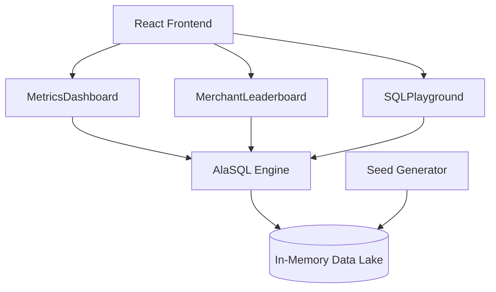

# 🚀 DoorDash Ad Analytics Dashboard

A high-performance, interactive analytics platform for tracking ad campaign effectiveness, merchant performance, and audience targeting. Built with React, TypeScript, and a powerful in-memory SQL engine (AlaSQL).


## ✨ Features

- **📊 Advanced Metrics Dashboard**: Real-time KPI tracking for Revenue, Orders, Spend, ROAS, Impressions, and Clicks.
- **📅 Weekly Revenue Composition**: Stacked Area Chart visualizing placement-specific revenue trends (Search, Categories, Collection, DoubleDash).
- **🎯 Audience Segmentation**: Deep dive into ad reach across VIP, Regular, Lapsed, and New User segments.
- **🥇 Merchant Leaderboard**: Performance-ranked leaderboard with sorting by revenue, orders, and ratings.
- **🔥 Performance Optimized**: Solved critical Cartesian product issues and reserved keyword conflicts in AlaSQL queries.
- **🌓 Dynamic Theming**: Sleek Dark/Light mode support with CSS variables.
- **🛠 SQL Playground**: Interactive environment to run raw SQL queries against the in-memory data lake.

## 🛠 Tech Stack

- **Frontend**: React 18, TypeScript, Vite
- **Visualization**: Recharts
- **Icons**: Lucide React
- **Database**: AlaSQL (In-memory SQL engine)
- **Styling**: Vanilla CSS with Design Tokens

## 🏗 Architecture



## 🚀 Getting Started

1. **Clone the repository**
   ```bash
   git clone https://github.com/Axelfernandes/ads_de_1.git
   cd ads_de_1
   ```

2. **Install dependencies**
   ```bash
   npm install
   ```

3. **Launch the dashboard**
   ```bash
   npm run dev
   ```

## 📂 Project Structure

- `src/components`: UI components and analytical views.
- `src/data`: Database initialization, synthetic seed generation, and schemas.
- `src/theme.ts`: Global design tokens and color scales.

## 🔮 Future Roadmap

- [ ] **AWS Cloud Integration**: Persistence via DynamoDB and S3 data lake.
- [ ] **Real-time API**: Integrate with live advertiser APIs.
- [ ] **Predictive Modeling**: Basic LTV and Churn prediction based on order patterns.

---
🚀 *Happy Analyzing!*
